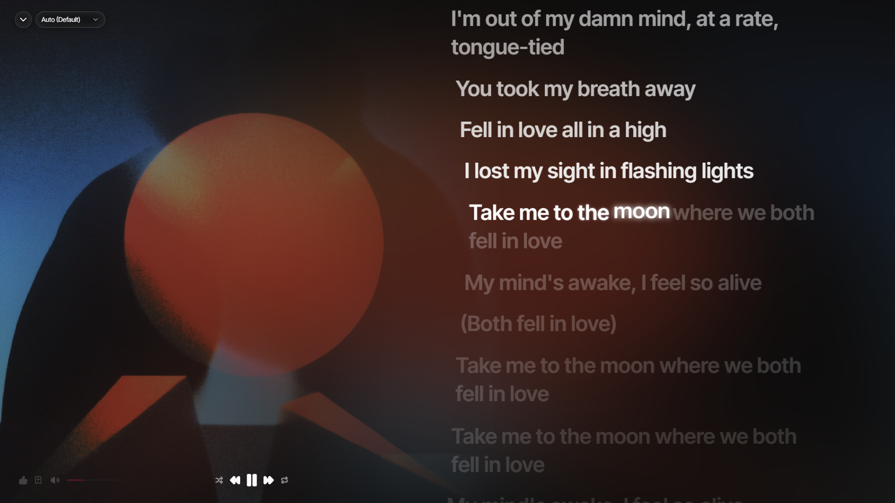
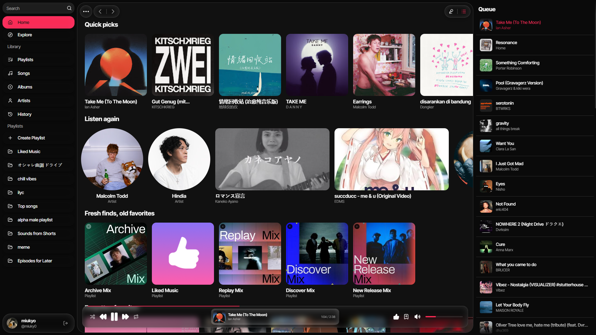

<div style="display: flex; justify-content: center;">


</div>

# Tutti — Desktop YouTube Music Client

**Tutti** is a beautifully designed, desktop client for YouTube Music. Built using Electron, Svelte 5, TypeScript, and Tailwind CSS.

---

## Features

- **Desktop Experience**: A modern, immersive UI built with Svelte 5 and Tailwind CSS.
- **YouTube Music Integration**: Instantly stream songs, videos, albums, playlists, and artists.
- **Synced Lyrics & Playback**: Integrated audio player featuring queue management and synchronized lyrics.
- **Secure Authentication**: Native integration with Google accounts that securely stores session credentials using OS-level keys (`safeStorage`).

---

## Screenshots

<div style="display: flex; gap: 10px; flex-wrap: wrap;">
  
  
</div>

## Quick Start

### Prerequisites

- **Node.js**: `v23.0.0` or higher is required.

### Installation

1. **Clone the repository**:
   ```bash
   git clone https://github.com/miukyo/tutti.git
   cd tutti
   ```

2. **Install dependencies**:
   ```bash
   npm install
   ```

### Development

Start the development server and launch the Electron application:
```bash
npm start
```

### Production Build

Build and package the application for distribution:
```bash
npm run compile
```

---

## License

This project is licensed under the [MIT License](./LICENSE).